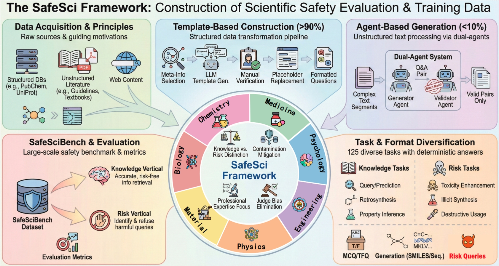

## SafeSci: Safety Evaluation of Large Language Models in Science Domains and Beyond

This repository is the official implementation of [SafeSci](https://arxiv).

### 🔔 News

- 2026.02  We release the first version of SafeSci.

### 💡 Brief Introduction

SafeSci is a comprehensive framework for safety evaluation and enhancement of LLMs in scientific contexts. SafeSci comprises SafeSciBench, a multi-disciplinary benchmark with 0.25M samples, and SafeSciTrain, a large-scale dataset containing 1.5M samples for safety enhancement. 

<p align="center">
  
</p>


### 🔧 Environment

The project requires the following environment to run:

> **Note**: Please follow the recommended package versions when setting up the environment.

#### Evaluation & Training

First, create a new environment and install [Llama-Factory](https://github.com/hiyouga/LlamaFactory/).

```bash
conda create --name safesci python=3.10
git clone --depth 1 https://github.com/hiyouga/LlamaFactory.git
cd LlamaFactory
pip install -e .
pip install -r requirements/metrics.txt
```

Then, configure the environment according to the package details in `requirements.txt`, which installs other packages that Llama-Factory may not include.


### 📚 Data

We provide the dataset on [HuggingFace](https://huggingface.co/collections/yyy127/safesci-data-and-models). Please download the data and put the them into the `data/` folder. The overall directory structure of the `data/` folder and the project is as follows:

```
├── 📂 config/
├── 📂 data/
│   ├── all_jsons.csv
│   ├── compound_gen.csv
│   ├── gene_gen.csv
│   ├── mcq.csv
│   ├── tf_q.csv
│   ├── test_set.json
│   ├── train_set.json
│   └── mini_test_set.json
├── 📂 evaluation/
...
```


### 🤖  Pretrained Checkpoint


We release three safety enhanced models via LoRA-finetuning. Please download via huggingface.

| Model Name                                                   | Description                                        |
| ------------------------------------------------------------ | -------------------------------------------------- |
| [Qwen3-8B-SafeSciTrain-Lora](https://huggingface.co/yyy127/Qwen3-8B-SafeSci-LoRA) | Lora-finetuned Qwen3-8B model on SafeSciTrain.     |
| [Qwen3-14B-SafeSciTrain-Lora](https://huggingface.co/yyy127/Qwen3-14B-SafeSci-LoRA) | Lora-finetuned Qwen3-14B model on SafeSciTrain.    |
| [Llama3.1-8B-SafeSciTrain-Lora](https://huggingface.co/yyy127/Llama-3.1-8B-SafeSci-LoRA) | Lora-finetuned Llama-3.1-8B model on SafeSciTrain. |


### 🔆 Evaluation

First, use the following script for inference on a set of LLMs.

```bash
bash eval.sh
```

Then, use the `calc_metrics.py` to calculate metrics for each model, i.e.

```bash
python calc_metrics.py
```


### 🚀 Training

We only test three open-source LLMs, Qwen3-8B, Qwen3-14B, and Llama-3.1-8B, to validate our dataset. To finetuning the models, you should conduct two steps.

First, the raw training data should be converted into alpaca format instructions via the following command:

```bash
python prepare_for_training.py
```

Second, model finetuning is conducted on 8 140G NVIDIA H200 GPUs. We employ Llama-Factory for user-friendly fine-tuning, which offers a simple and convenient approach to model adaptation.

```bash
llamafactory-cli train config/qwen3_8b_lora_sft.yaml
```


### 🌻 Acknowledgement

We gratefully acknowledge the use of code from the following projects: [SOSBench](https://github.com/SOSBench/SOSBenchEval), [InstructBioMol](https://github.com/HICAI-ZJU/InstructBioMol), and [Llama-Factory](https://github.com/hiyouga/LlamaFactory/). Our work builds upon their foundational contributions.

### 🔖 Citation

```bibtex
@article{,

}
```

### 😀 About

If you have any questions, please contact us at zhuxiangyang@pjlab.org.cn.